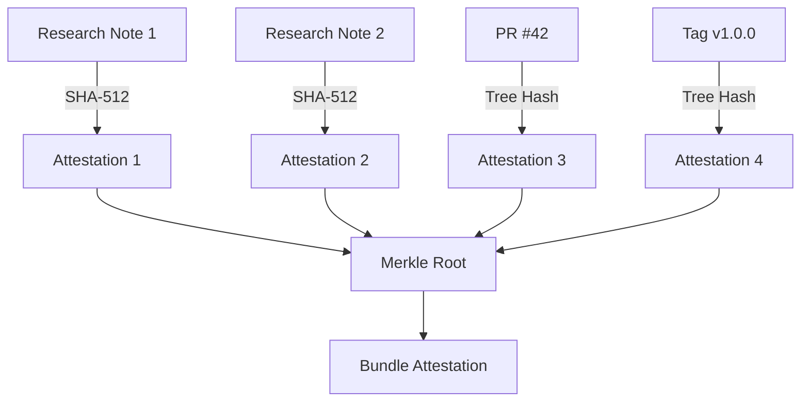

## What is a Proof Chain?

A proof chain is a sequence of cryptographically linked attestations that prove the timeline of your creative work. Each attestation references previous ones, creating an unbreakable chain of evidence.



## Components

### Fingerprints

Every piece of content is hashed with **SHA-512**:

```
SHA-512("Your research content...")
  → "e3b0c44298fc1c149afbf4c8996fb92427ae41e4649b934ca495991b7852b855..."
```

This fingerprint is:
- **Unique**: Different content = different hash
- **Deterministic**: Same content = same hash always
- **One-way**: Cannot reverse to original content

### Attestations

Each fingerprint is attested on **Base L2** via EAS:

```json
{
  "schema": "0x...",
  "data": {
    "projectId": "my-project",
    "category": "research",
    "fingerprint": "sha512:e3b0c44...",
    "treeHash": "sha512:...",
    "ref": "research/note.md",
    "effortHours": 250
  }
}
```

### Merkle Root

All attestations combine into a **Merkle tree**:

```
        Merkle Root
           /    \
      Hash(A+B)  Hash(C+D)
       /    \     /    \
      A      B   C      D
```

The root proves all attestations without revealing individual content.

## Verification

Anyone can verify your proof chain:

1. **Find the attestation** on [base.easscan.org](https://base.easscan.org)
2. **Check the timestamp** - blockchain provides authoritative time
3. **Verify the fingerprint** - hash the content yourself
4. **Follow the chain** - each attestation links to the project

## Legal Strength

The proof chain provides:

| Evidence Type | Traditional | SESHAT |
|---------------|-------------|--------|
| Timestamp | Self-reported | Blockchain-verified |
| Content proof | Witness testimony | Cryptographic hash |
| Tamper evidence | None | Immutable ledger |
| Third-party verification | Notary ($$) | Public blockchain (free) |

<Info>
  Courts increasingly accept blockchain timestamps as evidence. The immutability and public verifiability make them legally robust.
</Info>
