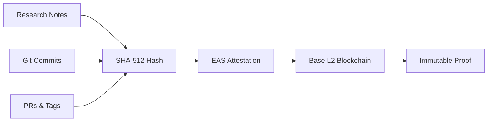

## What is SESHAT?

**SESHAT** is an MCP (Model Context Protocol) server that provides **intellectual property protection** through blockchain attestations. Named after the ancient Egyptian goddess of writing, wisdom, and record-keeping, SESHAT creates immutable proof of your creative work.

<CardGroup cols={2}>
  <Card
    title="Research Certification"
    icon="flask"
    href="/docs/proof-chain"
  >
    Anchor your Obsidian research notes on blockchain with SHA-512 fingerprints
  </Card>
  <Card
    title="Code Sealing"
    icon="code-branch"
    href="/api/seal"
  >
    Seal commits, PRs, tags, and releases with immutable attestations
  </Card>
  <Card
    title="Legal Deposits"
    icon="file-contract"
    href="/docs/legal-deposit"
  >
    Generate complete evidence bundles for copyright registration
  </Card>
  <Card
    title="Post-Quantum Security"
    icon="shield-halved"
    href="/docs/pqc-signatures"
  >
    ANSSI-compliant hybrid signatures (ECDSA + ML-DSA)
  </Card>
</CardGroup>

## Why SESHAT?

Traditional IP protection relies on trust:
- Filing dates that can be disputed
- Centralized registries that can be compromised
- Paper trails that can be lost

SESHAT creates **cryptographic proof** anchored on **Base L2** blockchain:
- **Immutable**: Once attested, proof cannot be altered
- **Timestamped**: Blockchain provides authoritative timestamps
- **Verifiable**: Anyone can verify attestations on EAS
- **Sovereign**: You control your proof chain

## The Proof Chain

Every piece of work is:
1. **Hashed** with SHA-512 for unique fingerprinting
2. **Attested** via EAS (Ethereum Attestation Service)
3. **Anchored** on Base L2 (low-cost, high-speed)
4. **Recorded** in your local SQLite ledger

## Use Cases

<AccordionGroup>
  <Accordion title="R&D Tax Credits (CIR/CII)">
    Certify research hours with blockchain timestamps. Generate reports that prove development effort for tax credit applications.
  </Accordion>
  <Accordion title="Copyright Protection">
    Create timestamped evidence of creation before publishing. Bundle releases for legal deposit organisms like SafeCreative.
  </Accordion>
  <Accordion title="Patent Prior Art">
    Establish priority dates for inventions. Prove you had the idea first with immutable blockchain timestamps.
  </Accordion>
  <Accordion title="Open Source Provenance">
    Track contributions and prove authorship. Seal releases with cryptographic attestations.
  </Accordion>
</AccordionGroup>

## Quick Links

<CardGroup cols={3}>
  <Card
    title="Quickstart"
    icon="rocket"
    href="/quickstart"
  >
    Get started in 5 minutes
  </Card>
  <Card
    title="MCP Tools"
    icon="wrench"
    href="/api/status"
  >
    Explore the API
  </Card>
  <Card
    title="GitHub"
    icon="github"
    href="https://github.com/menezis-ai/seshat-mcp"
  >
    View source code
  </Card>
</CardGroup>
